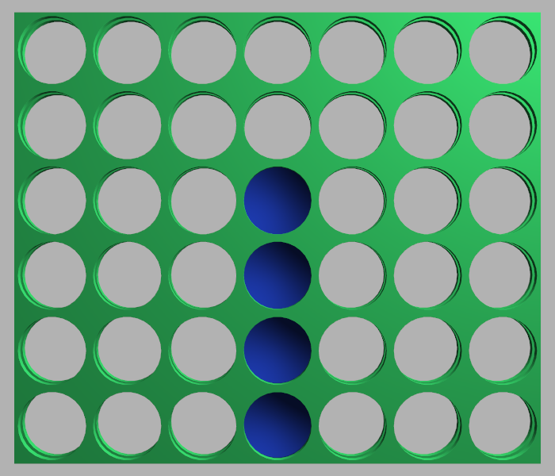
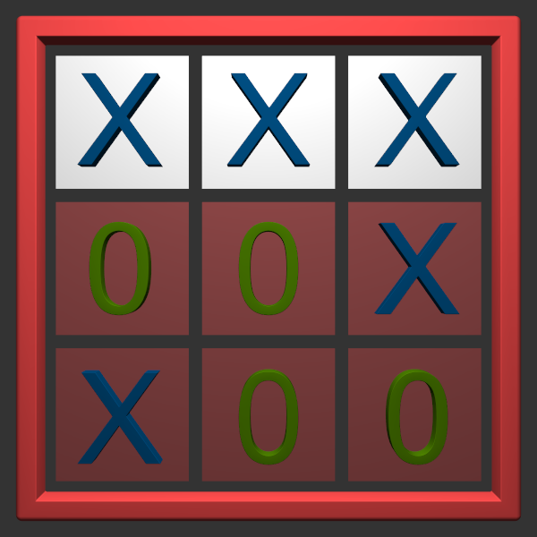
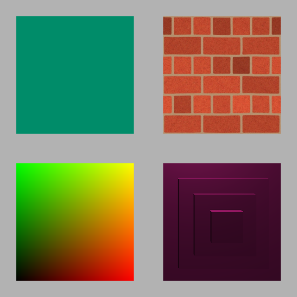

# Lamp

Game engine for simple games created with **C++** and **OpenGL**.

Libraries used: **[glfw](https://github.com/glfw/glfw)**
                **[glad](https://github.com/Dav1dde/glad)**
                **[glm](https://github.com/g-truc/glm)**
                **[assimp](https://github.com/assimp/assimp)**
                **[imgui](https://github.com/ocornut/imgui)**
                **[bullet3](https://github.com/bulletphysics/bullet3)**.

## Games

### Connect Four

### Tic Tac Toe

## Demo

### Squares

